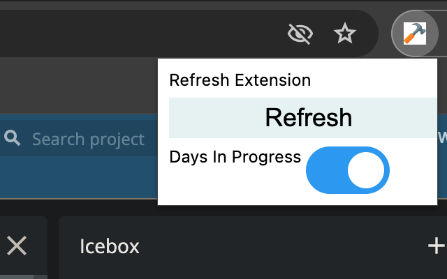

# Pivotal Extensions

Inspired by [Story Time](https://github.com/bertrandmoulard/story_time/tree/master), the purpose of this extension is to make tweaks to Pivotal Tracker's UI to enhance usability. The first piece of functionality is (like Story Time), to set a visual indicator of how long a card has been in progress; but several other features are planned.

Pivotal Extensions uses the authentication information of the logged-in user to communicate with Pivotal's API, instead of asking the user for their API key. This is both more convenient and more secure, as nothing is stored in local storage except the preferences for the extension.




# Building

As of the creation of this project, it is not possible to create a manifest v3 extension that is compatible with both Chrome and Firefox. The goal with this project was to have something compatible with both browsers, so I moved browser specific files to their own folder, and created a couple of node scripts to pull the browser extensions together.

There are two build commands, `build-chrome` and `build-firefox`. Run either to produce a zip containing the extension in the `output` folder. 

```
npm run build-chrome
```

There is also the `clean` command to clear the temporary directories.

## License

See the [LICENSE](LICENSE.md) file for license rights and limitations (MIT).