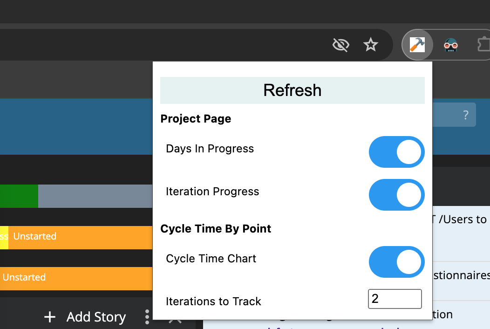
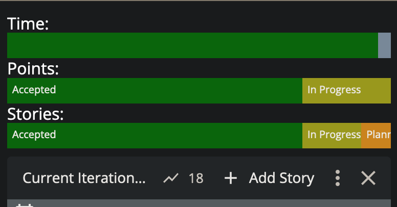
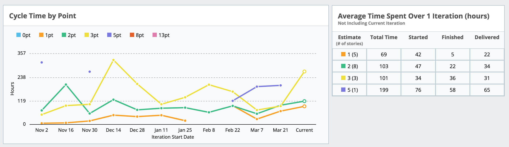
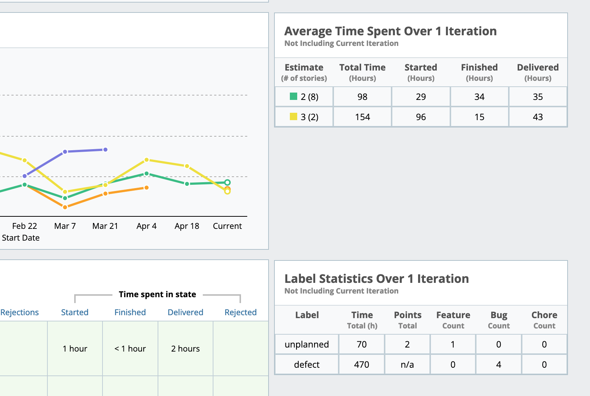

# Pivotal Extensions

Inspired by [Story Time](https://github.com/bertrandmoulard/story_time/tree/master), the purpose of this extension is to make tweaks to [Pivotal Tracker's](https://www.pivotaltracker.com/) project panel UI to give teams some important information at a glance. Current features:

- Days in Progress
- Iteration Progress
- Cycle Time By Point Detail Chart
- Label Statistics Chart

# Usage

Features can be toggled on / off in the options menu.



> Note that in Firefox, you may have to right-click the extension after installing it and select `Always Allow on www.pivotaltracker.com` for it to work initially.

**Days in Progress** Adds a sun emoji for every day a story has been in progress. This helps to bring visibility to long-running stories that "should be done today" for days at a time.


**Iteration Progress** Adds a series of progress bars above the current iteration column header giving a visual indication of how far through the iteration the team is in stories and points compared to the current date.



**Cycle Time By Point Detail Chart** Adds a chart on the Analytics -> Cycle Time page that gives adds more details to the Cycle Time by Point chart. Specifically, it gives the average time a story with a given estimate spends in total, and in several key states over the given number of iterations. 

*Disclaimer:* Points don't equal time, and it's important that the whole team understands why. However, retrospectively it can be advantagous to look for patterns in a team's estimation. It takes a high degree of trust within the team to do this effectively, but the goal of surfacing these metrics is to drive conversations around potential behavior changes that lead to more effective development. The intent is not to pursue any metric for the sake of itself.



**Label Statistics Chart** Adds a chart on the Analytics -> Cycle Time page that gives some basic statistics on the labels a user specifies. Specifically, it shows the total hours worked on cards with that label, the number of points associated with those cards (if applicable), and the total number of Feature, Chore, and Bug cards with that label.



### Authentication

Pivotal Extensions uses the authentication information of the logged-in user to communicate with Pivotal's API, instead of asking the user for their API key. This is both more convenient and more secure, as nothing is stored in local storage except the preferences for the extension.

# Building

As of the creation of this project, it is not possible to create a manifest v3 extension that is compatible with both Chrome and Firefox. The goal with this project was to have something compatible with both browsers, so I moved browser specific files to their own folder, and created a couple of node scripts to pull the browser extensions together.

There are two build commands, `build-chrome` and `build-firefox`. Run either to produce a zip containing the extension in the `output` folder. 

```
npm run build-chrome
```

There is also the `clean` command to clear the temporary directories.

## License

See the [LICENSE](LICENSE.md) file for license rights and limitations (MIT).